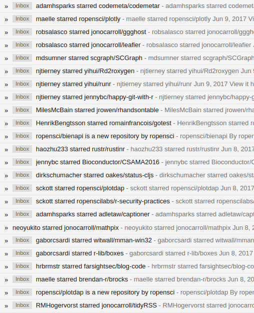
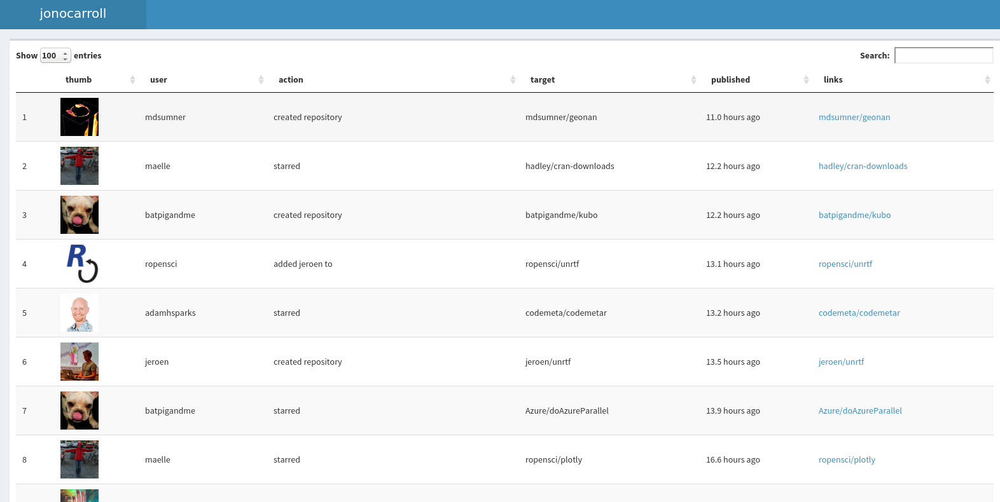

# starryeyes

[]()
[](https://travis-ci.org/jonocarroll/starryeyes)


Discover new packages through social delegation! 

## Installation

You can install starryeyes from github with:

``` r
# install.packages("devtools")
devtools::install_github("jonocarroll/starryeyes")
```

## Motivation

GitHub doesn't officially have an API endpoint for "_which of the people I follow starred something?_" but I wanted a way to do this. Originally I set up an IFTTT action to watch my private GitHub RSS feed and send me an email when a new star appeared, but this quickly filled my inbox.



This way, I can check-in when I like.


## Usage:

1. Follow some trendsetters on GitHub.
2. Wait until they star a heap of cool repos
3. `starryeyes()` to produce a `shinydashboard` of the activity.

This will work out your GitHub username by itself if you're using a `GITHUB_PAT` environment variable already. If not, you can supply your GitHub `username`. You can enter your `password` or be prompted (securely) for it. You can just provide the `feedURL` if you rather skip all of that (see `github.com` if you're logged in).

The final product looks something like this:



## Future work:

- Cache the results so they accumulate over time
- Remove duplicates (spread them out over a unique starring)
- shinyapps.io (?)


_"Oh my God! — it's full of stars!"_
